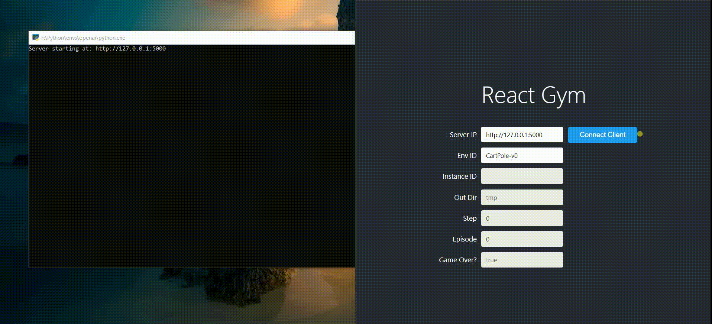

# React Gym

Starter project for using OpenAI Gym in React



## Usage

### Install Gym HTTP Server

- You need [gym-http-server](https://github.com/saravanabalagi/gym-http-server), you can install with pip using:

```sh
pip install gym-http-server
gym-http-server
```
This will start the Gym HTTP Server at `localhost:5000`.

- Start the React Gym Client

```sh
git clone https://github.com/saravanabalagi/react-gym
cd react-gym
npm install
npm start
```
React Client is served by default at `localhost:3000`
